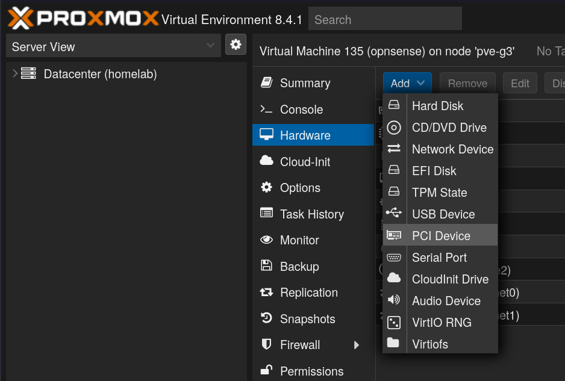
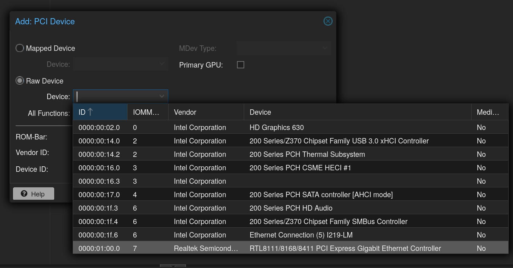
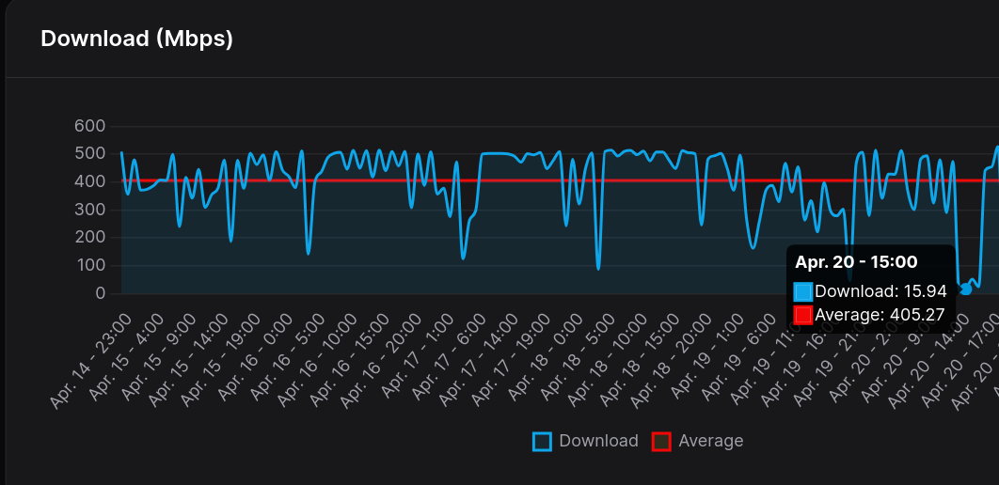
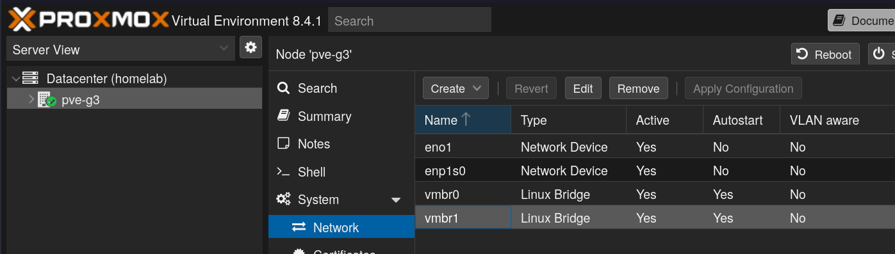
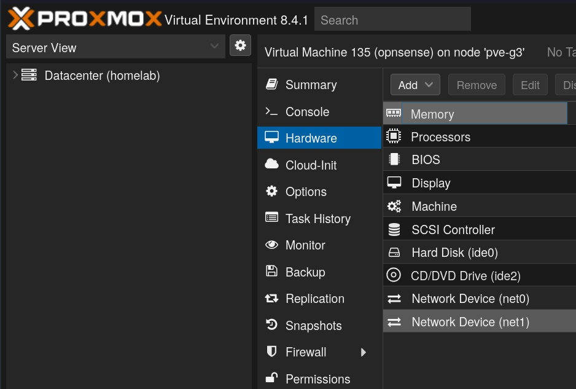

For the past few years, I've been running pfSense (and more recently OPNsense) in a virtual machine within Proxmox. This has been running fine with a single onboard Intel NIC. A few months ago, I upgraded to a machine that has a CPU that supports hardware-accelerated transcoding, has more SATA ports, and has more PCI slots for future expansion. With the goal of having a dedicated NIC for WAN, I bought an inexpensive 1Gbps PCIe NIC (TG-3468) despite reading about some of the concerns around Realtek NICs (sluggish performance, driver instability, and in some cases system crashes).

I've been running a Realtek NICs reliably on Linux and Windows desktops, so I figured I could make it work without too much effort, but it turns out Realtek NICs really can be problematic when it comes to FreeBSD-based routers, and some commonly documented workarounds did not solve my problems.

<!--more-->

## Environment

My environment consists of:

- Proxmox 8.4
- OPNsense 25.1 (Virtual Machine)
- Ethernet controller: Intel Corporation Ethernet Connection (5) I219-LM
- Ethernet controller: Realtek Semiconductor Co., Ltd. RTL8111/8168/8411 PCI Express Gigabit Ethernet Controller (rev 15)

# Goal

The goal is to upgrade the OPNsense router from a single NIC to two NICs. The NICs are responsible for:

1. **LAN**: the internal network for computers, phones, cameras, printers, etc (NIC 1)
2. **WAN**: the connection from the ISP (NIC 2)

Having two separate physical interfaces for LAN and WAN creates clear, physical separation between the trusted internal network and the untrusted external network at the hardware level. This also should improve performance and throughput since the same physical connection is no longer shared between LAN and WAN.

## Device Passthrough

For maximum performance and reduced hypervisor overhead, passing through a physical NIC for WAN directly to the VM seemed to make the most sense, so I passed it through to the OPNsense VM.

I added the PCI device and restarted the OPNsense VM and re-configured the WAN in OPNsense to use this device.

I received the WAN IP and everything appeared to be working. I ran a few speed tests and noticed that the download speeds were a lot lower than normal on multiple devices. I checked my instance of [speedtest-tracker](https://docs.speedtest-tracker.dev) noticed that the download speeds were significantly slower than historical records:

These speeds tests were going through Mullvad, which occasionally is inconsistent, but the results remained consistently lower than the previous configuration.

I reverted the WAN back to the original NIC, and the download speeds returned to more average results immediately so it became obvious that something was not right with this setup.

### Realtek drivers

I did some web searching / LLM prompting and discovered that some people have had improved results after installing the OPNsense plugin **os-realtek-re**.

After installing the plugin and ensuring the kernel module was loaded at boot by following the post-install instructions, the throughput was still signicantly slower than before adding a second NIC.

I was starting to think that there might be a problem with the hardware and began the process to return it to the vendor.

## Virtualized NIC with a Linux bridge

As one last shot, I created Linux Bridge in the Proxmox GUI with the Realtek NIC and passed it through to the OPNsense VM:

I re-configured the WAN interface in OPNsense to use the newly added network device, and the download and upload speeds returned to the typical speeds. Another added benefit to this setup is that it bypasses the need for installing Realtek FreeBSD drivers on the OPNsense VM, since the network device is virtual and managed on the Proxmox host (debian-based).

## Conclusion

Although I am not sure why passing through a Realtek NIC to an OPNsense VM causes so much degradation in throughput, I am glad that there is a workaround. If I get ahold of another NIC, I would be interested in trying to reproduce the issue.
