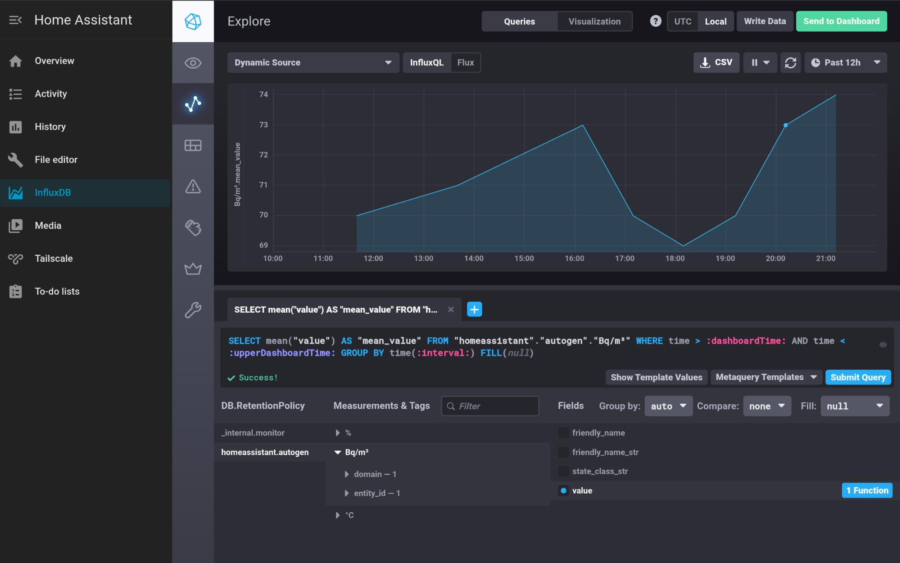
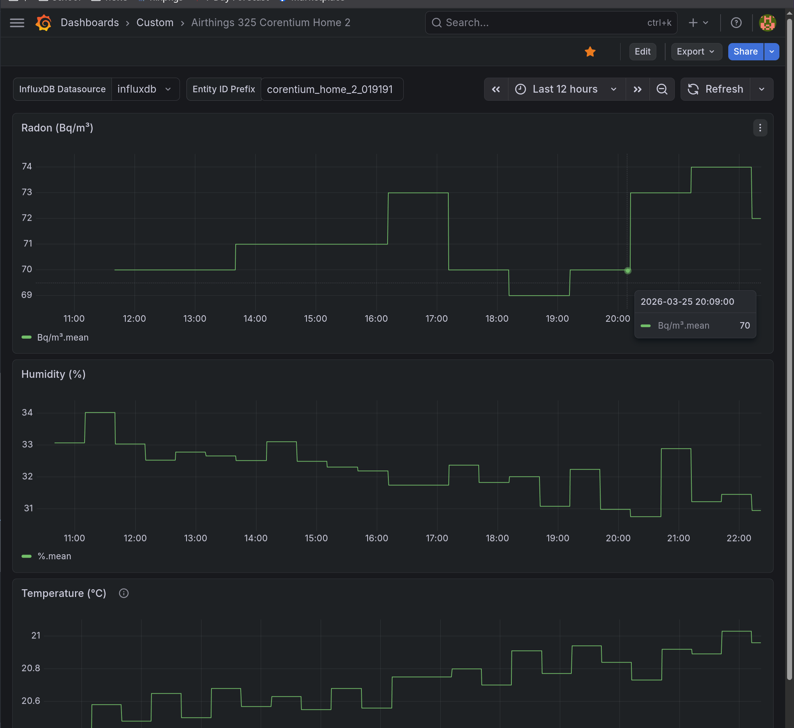
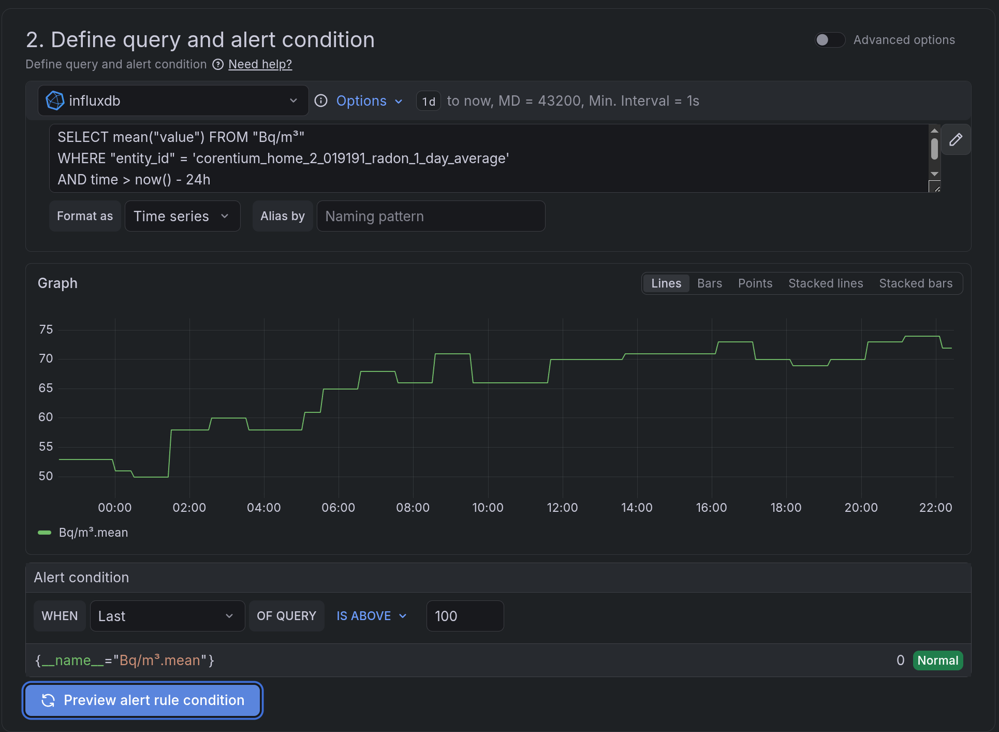

Radon is a radioactive gas that can be found in homes, and at high levels and persistent exposure, can be [extremely dangerous to breathe in](https://www.youtube.com/watch?v=PLYMBdJ5SvI). Radon gas comes from the natural decay of uranium in soil and rock, and it can seep into homes through cracks in the foundation, and can even permeate through concrete. [Health Canada recommends](https://www.canada.ca/en/health-canada/services/environmental-workplace-health/radiation/radon/testing-your-home.html) taking action if radon levels exceed 200 Bq/m³, while the [WHO guideline](https://www.who.int/news-room/fact-sheets/detail/radon-and-health) is 100 Bq/m³.

I recently became more concerned about radon since I live and work in a basement daily. I decided to explore some ways to, not only monitor radon levels, but also hook up the metrics to my existing homelab.

<!--more-->
## Home Assistant

My first thought was to try to plug into an ecosystem that is already robust. [Home Assistant](https://www.home-assistant.io/) is an open-source home automation platform that allows you to monitor and control various aspects of your home. It supports a wide range of sensors and devices, including radon detectors. By integrating sensors with Home Assistant, it is easy to monitor radon levels in your home and receive alerts if they exceed safe thresholds.

Of course, the first step is to get actual hardware that is designed to detect radon. I went with the [Airthings 325 Corentium Home 2](https://www.airthings.com/en-ca/corentium-home-2-ca), which is the sequel to a well-trusted radon detector. It has a built-in display that shows the current radon levels, and it also has Bluetooth connectivity, which could unlock the ability share metrics with Home Assistant. I was skeptical at first if this could work without having to integrate with a cloud subscription, but it turns out that Home Assistant has a [built-in integration](https://www.home-assistant.io/integrations/airthings_ble/) that can pull in the radon levels and other metrics from the device, and **Corentium Home 2** is on the list of supported devices!

One of the downsides of the Corentium Home 2 is that it will not passively sync data over time by itself. It will only sync when you open the app. This is not a problem with the Home Assistant integration, because this integration will pull data periodically, eliminating the need to have to manually sync the data using a mobile app.

Installing home assistant is straightforward. In my case, I installed it on Proxmox, using [this community script](https://community-scripts.org/scripts/haos-vm).

After installing home assistant and passing through my bluetooth dongle to the VM, I was able to add the Airthings BLE integration and start to see metrics in the home assistant web ui:


## InfluxDB

Okay, so I have a view of the sensor data in Airthings BLE integration in HA (Home Assistant). How do I export these metrics as time series data and integrate with grafana? I explored a few options: prometheus, influxdb, and [statistics](https://www.home-assistant.io/integrations/statistics/). I went with InfluxDB since it is a popular time series database that has good support for home assistant and grafana.

For simplicity's sake, I installed it using [InfluxDB Community Addon](https://github.com/hassio-addons/addon-influxdb).

After installing the addon, I had to configure Home Assistant to send the metrics to InfluxDB. This is done by adding the following configuration to the `configuration.yaml` file:

```yaml
influxdb:
  include:
    entities:
      - sensor.corentium_home_2_019191_radon_1_day_average
      - sensor.corentium_home_2_019191_radon_longterm_average
      - sensor.corentium_home_2_019191_temperature
      - sensor.corentium_home_2_019191_humidity
      - sensor.corentium_home_2_019191_battery
```

I restarted HA but was unable to see any metrics in InfluxDB. After some troubleshooting, I realized that I had to create a database and then configure HA to use that database. I created a database called **homeassistant** and created a new user with appropriate permissions to this database. I can now see the metrics in InfluxDB, and I can query them using the InfluxDB web interface:



## Grafana Dashboard

It's nice to be able to visualize the data in InfluxDB, but I want to be able to create custom dashboards and alerts. Grafana's alerting is powerful. It's also easy to setup notifications via Slack, email, PagerDuty, etc. when radon spikes above a threshold.

After exposing both grafana and homeassistant to my [tailnet](https://tailscale.com/docs/concepts/tailnet), I added InfluxDB as a datasource in Grafana and created a dashboard to visualize the radon levels over time:



The json export of this dashboard can be found [here](https://gist.github.com/davegallant/f3cc394bb7e17ca06e105a33eccebd7a).

## Grafana Alerts

Now that the dashboard is setup, I would prefer to setup an alerting rule to notify me when radon levels spike above a certain threshold.

Make sure before you setup an alert, you create a [contact point](https://grafana.com/docs/grafana/latest/alerting/fundamentals/notifications/contact-points/). I chose a web hook that sends to a [gotify](https://gotify.net/) instance that I have running in my homelab, since I prefer this over email.

Overcautiously, I setup an alert such that if the radon levels exceed 100 Bq/m³, I get a notification:



I modified this to a lower threshold temporarily to simulate an alert, and it worked!


## Conclusion

It is reassuring to be able to monitor radon levels in my home and receive alerts if they exceed safe thresholds. The integration with Home Assistant, InfluxDB, and Grafana allows me to have a comprehensive view of the radon levels over time, and I can easily share this dashboard with family members. The metrics are still coming in, so seeing the data over 90 days will provide more accurate long-term averages that can be used to act on.
