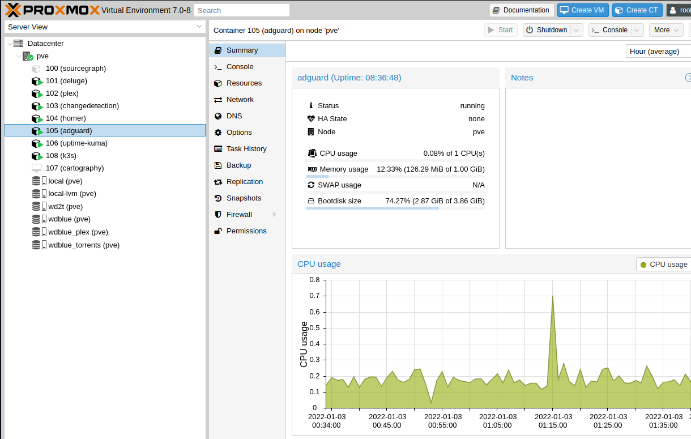

A homelab can be an inexpensive way to host a multitude of internal/external services and learn _a lot_ in the process.

<!--more-->

Do you want host your own media server? ad blocker? reverse proxy?
Are you interested in learning more about Linux? Virtualization? Networking? Security?
A homelab can be a playground to enhance your computer skills, without worrying about breaking anything important.

One of the best parts about building a homelab is that it doesn't have to be a large investment in terms of hardware. One of the simplest ways to build a homelab is out of a [refurbished computer](https://ca.refurb.io/products/hp-800-g1-usff-intel-core-i5-4570s-16gb-ram-512gb-ssd-wifi-windows-10-pro?variant=33049503825943).
Having multiple machines/nodes provides the advantage of increased redundancy, but starting out with a single node is enough to reap many of the benefits of having a homelab.

## Virtualization

Virtualizing your hardware is an organized way of dividing up your machine's resources. This can be done with something such as a _Virtual Machine_ or something lighter like a container using _LXC_ or _runC_.
Containers have much less overhead in terms of boot time and storage allocation. This [Stack Overflow answer](https://stackoverflow.com/questions/16047306/how-is-docker-different-from-a-virtual-machine) sums it up nicely.

A hypervisor such as [Proxmox](https://www.proxmox.com/en/proxmox-ve/get-started) can be installed in minutes on a new machine. It provides a web interface and a straight-forward way to spin up new VMs and containers. Even if your plan is to run mostly docker containers, Proxmox can be a useful abstraction for managing VMs, disks and running scheduled backups. You can even run docker within an LXC container by enabling nested virtualization. You'll want to ensure that VT-d and VT-x are enabled in the BIOS if you decide to install a hypervisor to manage your virtualization.

## Services

Here is a list of some useful services to consider:

- [Jellyfin](https://jellyfin.org/) or [Plex](https://www.plex.tv/) - a common gateway to self-hosting that enables a "self-hosted Netflix" experience that puts you in control of the content (guaranteed to make your partner and kids happy)
- [changedetection](https://github.com/dgtlmoon/changedetection.io) - is a self-hosted equivalent to something like [visualping.io](https://visualping.io/) that can notify you when a webpage changes and keep track of the diffs
- [Adguard](https://github.com/AdguardTeam/AdGuardHome) or [Pihole](https://pi-hole.net/) - can block a list of known trackers for all clients on your local network with the added benefit of speeding up web page load times
- [gitea](https://gitea.io/) - A lightweight git server that can be used to mirror git repos and host private content
- [gethomepage](https://github.com/gethomepage/homepage) - A customizable landing page for quick access to services with many supported widgets that can query APIs and display information
- [Uptime Kuma](https://github.com/louislam/uptime-kuma) - A tool for monitoring the uptime of services, with notification support
- [Speedtest Tracker](https://github.com/alexjustesen/speedtest-tracker) - a way to monitor the performance of your internet connection and/or vpn connection
- [Stirling-PDF](https://github.com/Stirling-Tools/Stirling-PDF) - a self-hosted PDF manipulation tool that will keep your data private

There is a large number of services you can self-host, including your own applications that you might be developing. Homelabbing allows you to have control over your data and services, and gives you the opportunity to be a software, network, and infrastructure engineer all at once.

## VPN

[Tailscale](https://tailscale.com/) is a quick way to create a flat network for all of your services. With its [MagicDNS](https://tailscale.com/kb/1081/magicdns/), your can reference the names of machines like `changedetection` rather than using an IP address, or managing DNS yourself. By using this mesh-like VPN, you can easily create a secure tunnel to your homelab from anywhere.

## Monitoring

Monitoring can become an important aspect of your homelab after it starts to become something that is relied upon. One of the simplest ways to setup some monitoring is using [netdata](https://www.netdata.cloud/). It can be installed on individual containers, VMs, and also a hypervisor (such as Proxmox). All of the monitoring works out of the box by detecting disks, memory, network interfaces, etc.

Additionally, agents installed on different machines can all be centrally viewed in netdata, and it can alert you when some of your infrastructure is down or in a degraded state. Adding additional nodes to netdata is as simple as a 1-line shell command.

As mentioned above, [Uptime Kuma](https://github.com/louislam/uptime-kuma) is a convenient way to track uptime and monitor the availability of your services.

## In Summary

Building out a homelab can be a rewarding experience and it doesn't require buying a rack full of expensive servers to get a significant amount of utility. There are many services that you can run that require very minimal setup, making it possible to get a server up and running in a short period of time, with monitoring, and that can be securely connected to remotely.

If you're looking for a steady stream of ideas for your homelab, check out [selfhosted.show](https://selfhosted.show/).
