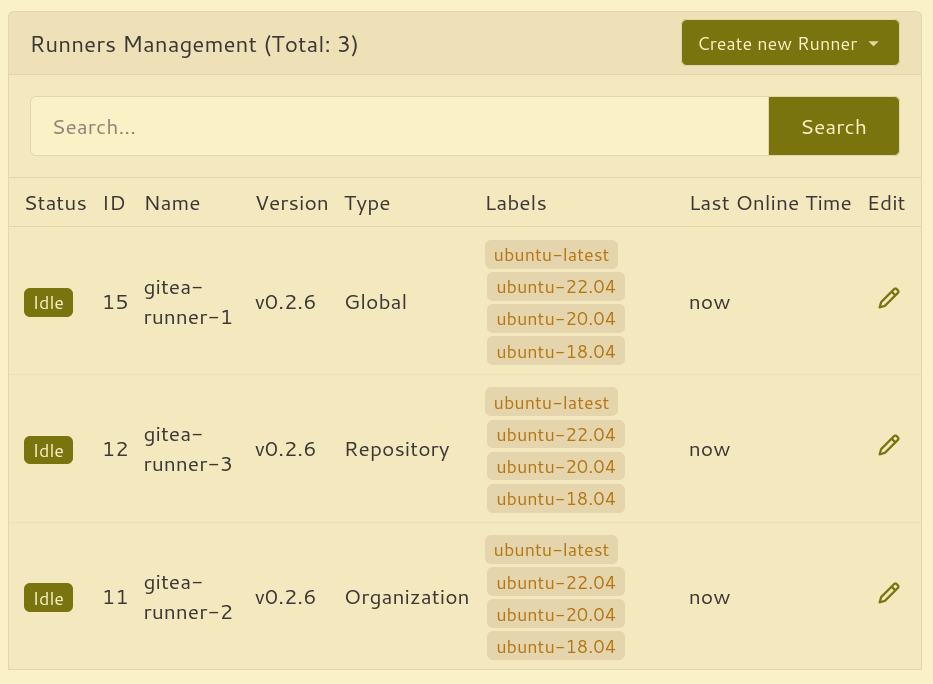

In this post I'll go through the process of setting up Gitea Actions and [Tailscale](https://tailscale.com/), unlocking a simple and secure way to automate workflows.

<!--more-->

## What is Gitea?

[Gitea](https://about.gitea.com/) is a lightweight and fast git server that has much of the same look and feel as github. I have been using it in my homelab to mirror repositories hosted on other platforms such as github and gitlab. These mirrors take advantage of the decentralized nature of git by serving as "backups". One of the main reasons I hadn't been using it more often was due to the lack of integrated CI/CD. This is no longer the case.

## Gitea Actions

[Gitea Actions](https://docs.gitea.com/usage/actions/overview) have made it into the [1.19.0 release](https://blog.gitea.com/release-of-1.19.0/). This feature had been in an experimental state up until [1.21.0](https://blog.gitea.com/release-of-1.21.0/) and is now enabled by default 🎉.

So what are they? If you've ever used GitHub Actions (and if you're reading this, I imagine you have), these will look familiar. Gitea Actions essentially enable the ability to run github workflows on gitea. Workflows between gitea and github are not completely interopable, but a lot of the same workflow syntax is already compatible on gitea. You can find a documented list of [unsupported workflows syntax](https://docs.gitea.com/usage/actions/comparison#unsupported-workflows-syntax).

Actions work by using a [custom fork](https://gitea.com/gitea/act) of [nekos/act](https://github.com/nektos/act). Workflows run in a new container for every job. If you specify an action such as `actions/checkout@v4`, it defaults to downloading the scripts from github.com. To avoid internet egress, you could always clone the required actions to your local gitea instance.

Actions (gitea's implementation) has me excited because it makes spinning up a network-isolated environment for workflow automation incredibly simple.

## Integration with Tailscale

So how does Tailscale help here? Well, more recently I've been exposing my self-hosted services through a combination of traefik and the tailscale (through the tailscale-traefik proxy integration described [here](https://traefik.io/blog/exploring-the-tailscale-traefik-proxy-integration/)). This allows for a nice looking dns name (i.e. gitea.my-tailnet-name.ts.net) and automatic tls certificate management. I can also share this tailscale node securely with other tailscale users without configuring any firewall rules on my router.

## Deploying Gitea, Traefik, and Tailscale

In my case, the following is already set up:

- [docker-compose is installed](https://docs.docker.com/compose/install/linux/)
- [tailscale is installed on the gitea host](https://tailscale.com/kb/1017/install/)
- [tailscale magic dns is enabled](https://tailscale.com/kb/1081/magicdns/)

My preferred approach to deploying code in a homelab environment is with docker compose. I have deployed this in a [proxmox lxc container](https://pve.proxmox.com/wiki/Linux_Container) based on debian with a hostname `gitea`. This could be deployed in any environment and with any hostname (as long you updated the tailscale machine name to your preferred subdomain for magic dns).

The `docker-compose.yaml` file looks like:

```yaml
version: "3.7"
services:
  gitea:
    image: gitea/gitea:1.21.1
    container_name: gitea
    environment:
      - USER_UID=1000
      - USER_GID=1000

      - GITEA__server__DOMAIN=gitea.my-tailnet-name.ts.net
      - GITEA__server__ROOT_URL=https://gitea.my-tailnet-name.ts.net
      - GITEA__server__HTTP_ADDR=0.0.0.0
      - GITEA__server__LFS_JWT_SECRET=my-secret-jwt
    restart: always
    volumes:
      - ./data:/data
      - /etc/timezone:/etc/timezone:ro
      - /etc/localtime:/etc/localtime:ro
  traefik:
    image: traefik:v3.0.0-beta4
    container_name: traefik
    security_opt:
      - no-new-privileges:true
    restart: unless-stopped
    ports:
      - 80:80
      - 443:443
    volumes:
      - ./traefik/data/traefik.yaml:/traefik.yaml:ro
      - ./traefik/data/dynamic.yaml:/dynamic.yaml:ro
      - /var/run/tailscale/tailscaled.sock:/var/run/tailscale/tailscaled.sock
```

`traefik/data/traefik.yaml`:

```yaml
entryPoints:
  https:
    address: ":443"
providers:
  file:
    filename: dynamic.yaml
certificatesResolvers:
  myresolver:
    tailscale: {}
log:
  level: INFO
```

and finally `traefik/data/dynamic/dynamic.yaml`:

```yaml
http:
  routers:
    gitea:
      rule: Host(`gitea.my-tailnet-name.ts.net`)
      entrypoints:
        - "https"
      service: gitea
      tls:
        certResolver: myresolver
  services:
    gitea:
      loadBalancer:
        servers:
          - url: "http://gitea:3000"
```

Something to consider is whether or not you want to use ssh with git. One method to get this to work with containers is to use [ssh container passthrough](https://docs.gitea.com/installation/install-with-docker#ssh-container-passthrough). I decided to keep it simple and not use ssh, since communicating over https is perfectly fine for my use case.

After adding the above configuration, running `docker compose up -d` should be enough to get an instance up and running. It will be accessible at [https://gitea.my-tailnet-name.ts.net](https://gitea.my-tailnet-name.ts.net) from within the tailnet.

## Theming

I discovered some themes for gitea [here](https://git.sainnhe.dev/sainnhe/gitea-themes) and decided to try out gruvbox.

I added the theme by cloning [theme-gruvbox-auto.css](https://git.sainnhe.dev/sainnhe/gitea-themes/raw/branch/master/dist/theme-gruvbox-auto.css) into `./data/gitea/public/assets/css`. I then added the following to `environment` in `docker-compose.yml`:

```yaml
- GITEA__ui__DEFAULT_THEME=gruvbox-auto
- GITEA__ui__THEMES=gruvbox-auto
```

After restarting the gitea instance, the default theme was applied.

## Connecting runners

I installed the runner by [following the docs](https://docs.gitea.com/usage/actions/quickstart#set-up-runner). I opted for installing it on a separate host (another lxc container) as recommended in the docs. I used the systemd unit file to ensure that the runner comes back online after system reboots. I installed tailscale on this gitea runner as well, so that it can have the same "networking privileges" as the main instance.

After registering this runner and starting the daemon, the runner appeared in `/admin/actions/runners`. I added two other runners to help with parallelization.



## Running a workflow

Now it's time start running some automation. I used the [demo workflow](https://docs.gitea.com/usage/actions/quickstart#use-actions) as a starting point to verify that the runner is executing workflows.

After this, I wanted to make sure that some of my existing workflows could be migrated over.

The following workflow uses a matrix to run a job for several of my hosts using ansible playbooks that will do various tasks such as patching os updates and updating container images.

```yaml
name: Run ansible
on:
  push:
  schedule:
    - cron: "0 */12 * * *"

jobs:
  run-ansible-playbook:
    runs-on: ubuntu-latest
    strategy:
      matrix:
        host:
          - changedetection
          - homer
          - invidious
          - jackett
          - ladder
          - miniflux
          - plex
          - qbittorrent
          - tailscale-exit-node
          - tailscale-subnet-router
          - uptime-kuma
    steps:
      - name: Check out repository code
        uses: actions/checkout@v4
      - name: Install ansible
        run: |
          apt update && apt install ansible -y
      - name: Run playbook
        uses: dawidd6/action-ansible-playbook@v2
        with:
          playbook: playbooks/main.yml
          requirements: requirements.yml
          options: |
            --inventory inventory
            --limit ${{ matrix.host }}
      - name: Send failure notification
        uses: dawidd6/action-send-mail@v3
        if: always() && failure()
        with:
          server_address: smtp.gmail.com
          server_port: 465
          secure: true
          username: myuser
          password: ${{ secrets.MAIL_PASSWORD }}
          subject: ansible runbook '${{ matrix.host }}' failed
          to: me@davegallant.ca
          from: RFD Notify
          body: |
            ${{ github.server_url }}/${{ github.repository }}/actions/runs/${{ github.run_number }}
```

And voilà:


You may be wondering how the gitea runner is allowed to connect to the other hosts using ansible? Well, the nodes are in the same tailnet and have [tailscale ssh](https://tailscale.com/tailscale-ssh) enabled.

## Areas for improvement

One enhancement that I would like to see is the ability to send notifications on workflow failures. Currently, this [doesn't seem possible](https://github.com/go-gitea/gitea/issues/23725) without adding logic to each workflow.

## Conclusion

Gitea Actions are fast and the resource footprint is minimal. My gitea instance is currently using around 250mb of memory and a small fraction of a single cpu core (and the runner is using a similar amount of resources). This is impressive since many alternatives tend to require substantially more resources. It likely helps that the codebase is largely written in go.

By combining gitea with the networking marvel that is tailscale, running workflows becomes simple and fun. Whether you are working on a team or working alone, this setup ensures that your workflows are securely accessible from anywhere with an internet connection.
