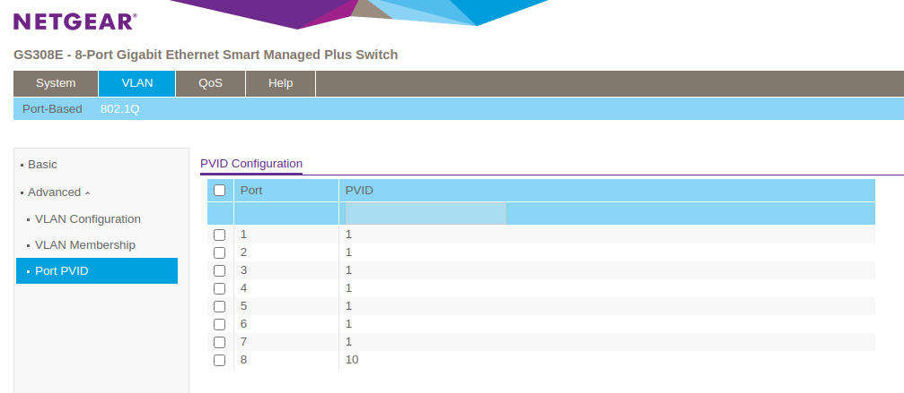
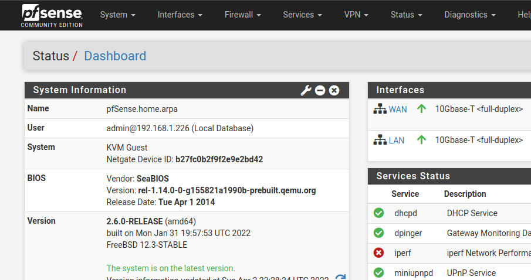

<!--more-->

## The problem

My aging router has been running [OpenWrt](https://en.wikipedia.org/wiki/OpenWrt) for years and for the most part has been quite reliable. OpenWrt is an open-source project used on embedded devices to route network traffic. It supports many different configurations and there exists a [large index of packages](https://openwrt.org/packages/index/start). Ever since I've connected some standalone wireless access points, I've had less of a need for an off-the-shelf all-in-one wireless router combo. I've also recently been experiencing instability with my router (likely the result of a combination of configuration tweaking and firmware updating). OpenWrt has served me well, but it is time to move on!

## pfSense

I figured this would be a good opportunity to try [pfSense](https://en.wikipedia.org/wiki/PfSense). I've heard nothing but positive things about pfSense and the fact it's been around since 2004, based on FreeBSD, and written in PHP gave me the impression that it would be relatively stable (and I'd expect nothing less because it has an important job to do!). pfSense can be run on many different machines, and there are even some [officially supported appliances](https://www.netgate.com/appliances). Since I already have a machine running Proxmox, why not just run it in a VM? It'd allow for automatic snapshotting of the machine. There is a good [video](https://www.youtube.com/watch?v=hdoBQNI_Ab8) on this by Techno Tim. Tim has a lot of good videos, and this one is about virtualizing pfSense.

## Router on a stick

I had initially made the assumption that in order to build a router, you would need more than a single NIC (or a dual-port NIC) in order to support both WAN and LAN. This is simply [not the case](https://en.wikipedia.org/wiki/Router_on_a_stick), because VLANs are awesome! In order to create a router, all you need is a single port NIC and a network switch that supports VLANs (also marketed as a managed switch). I picked up the Netgear GS308E because it has both a sufficient amount of ports for my needs, and it supports VLANs. It also has a nice sturdy metal frame which was a pleasant surprise.

After setting up this Netgear switch, it shoud be possible to access the web interface at [http://192.168.0.239](http://192.168.0.239). It may be at a different address. To find the address, try checking your DHCP leases in your router interface (if you plugged it into an existing router). I realized I was unable to access this interface because I was on a different subnet, so I set my machine's address to `192.168.0.22` in order to temporarily setup this switch. I assigned a static ip address to the switch (in `System > Switch Information`) so that it was in the same subnet as the rest of my network.

The web interface is nothing spectactular, but it allows for managing VLANs.

The following configuration will:

- assign port 1 to be the LAN (connected to the Proxmox machine)
- assign port 8 to be the WAN (connected to my ISP's modem)

In the switch's web interface, I went to `VLAN` and then `802.1Q`, and then clicked on `VLAN Configuration`. I configured the ports to look like this:

Note that the `VLAN Identifier Setting` has been setup already with two VLANs (1 and 10). More VLANs can be created (i.e. to isolate IoT devices), but 2 VLANs is all we need for the initial setup of a router.

To replicate the above configuration, add a new VLAN ID 10 (1 should exist by default).

Next, go into `VLAN Membership` and configure VLAN 1's port membership to be the following:

and then configure VLAN 10's port membership to be the following:

Now, go into `Port PVID` and ensure that port 8 is set to PVID 10.

This above configuration will dedicate two of the eight ports to WAN and LAN. This will allow the internet to flow into the pfSense from the modem.

## Setting up pfSense

pfSense is fairly easy to setup. Just [download the latest ISO](https://www.pfsense.org/download/) and boot up the virtual machine.
When setting up the machine, I mostly went with all of the defaults. Configuration can be changed later in the web interface, which is quite a bit simpler.

Since VLANs are going to be leveraged, when you go to `Assign Interfaces`, VLANs should be setup now like the following:

- `WAN` should be `vtnet0.10`
- `LAN` should be `vtnet0`

After going through the rest of the installation, if everything is connected correctly it should display both WAN and LAN addresses.

If all goes well, the web interface should be running at [https://192.168.1.1](https://192.168.1.1).

And this is where the fun begins. There are many tutorials and blogs about how to setup pfSense and various services and packages that can be installed. I've already installed [pfBlocker-NG](https://docs.netgate.com/pfsense/en/latest/packages/pfblocker.html).

## Summary

It is fairly simple to setup a router with pfSense from within a virtual machine. A physical dedicated routing machine is not necessary and often does not perform as well as software running on faster and more reliable hardware. So far, pfSense has been running for over a week without a single hiccup. pfSense is a mature piece of software that is incredibly powerful and flexible. To avoid some of the instability I had experienced with OpenWrt, I enabled [AutoConfigBackup](https://docs.netgate.com/pfsense/en/latest/backup/autoconfigbackup.html), which is capable of automatically backing up configuration upon every change. I plan to explore and experiment with more services and configuration in the future, so the ability to track all of these changes gives me the peace of mind that experimentation is safe.
